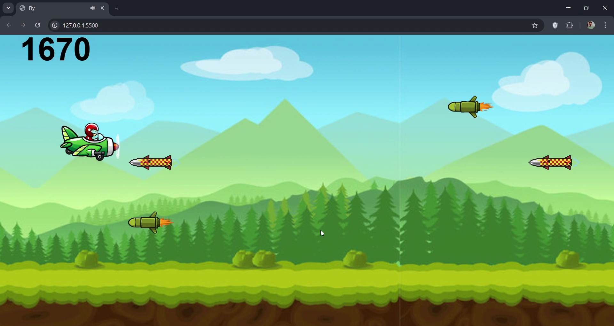
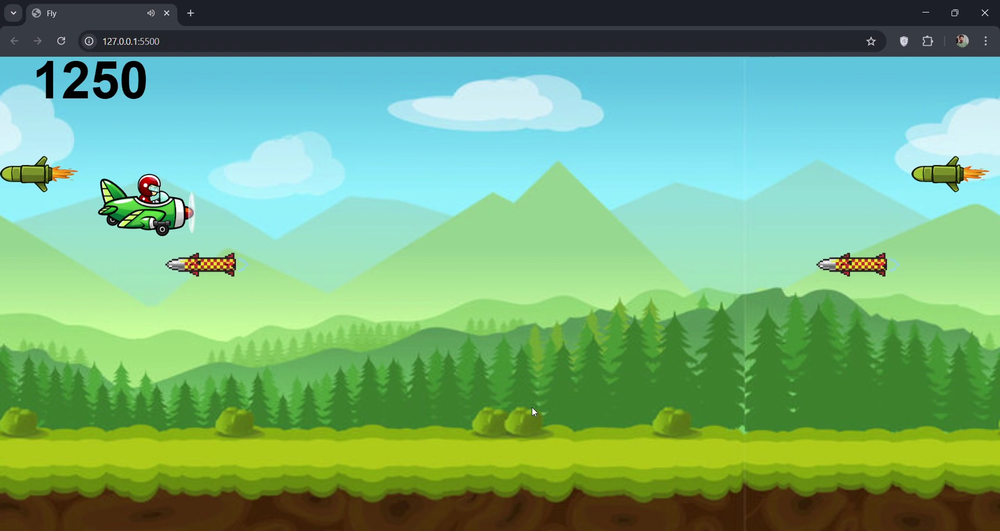
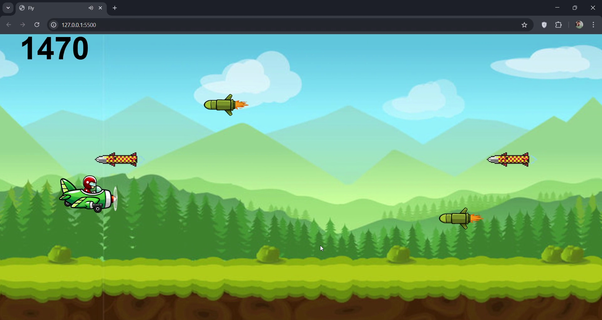
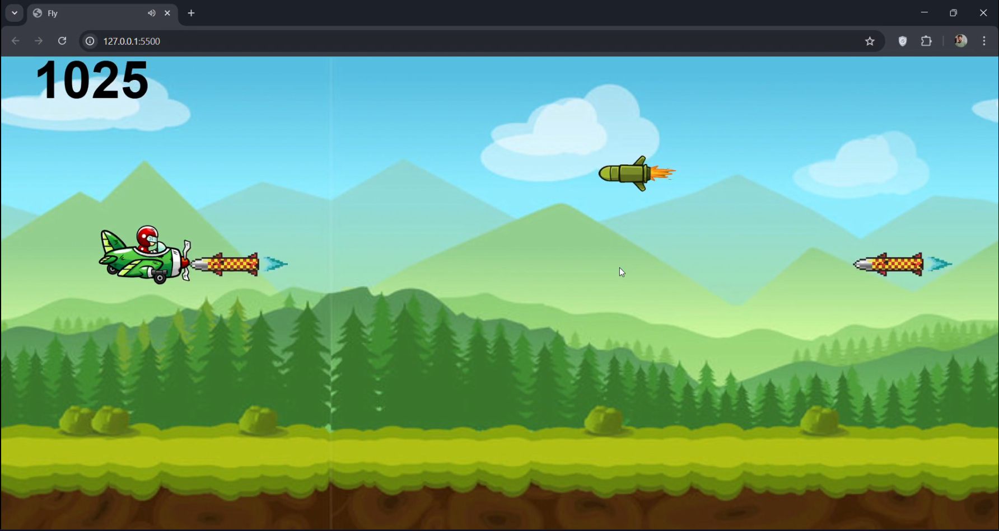
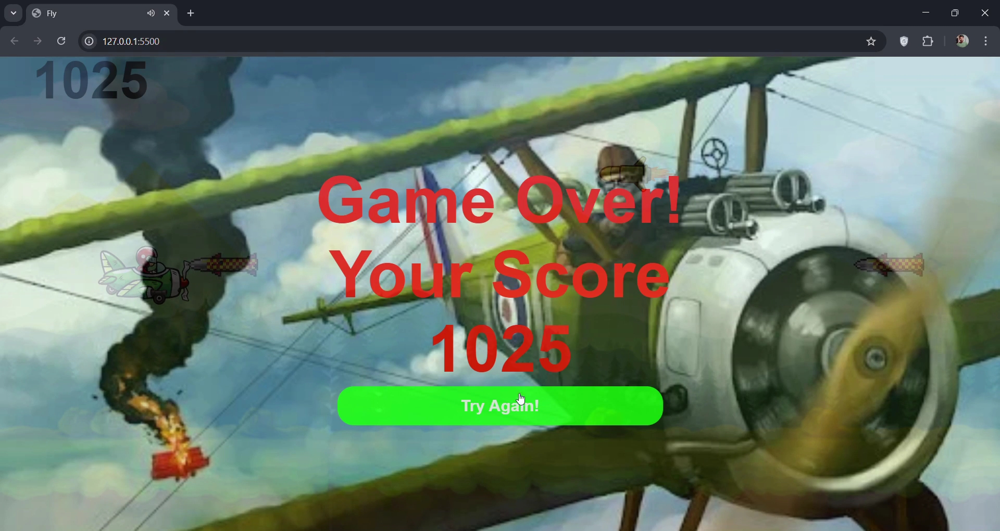

# ✈️ Sky Rush – 2D Plane Game

Sky Rush is a simple 2D plane game built using JavaScript, HTML, and CSS.  
It features smooth animations, continuous background scrolling, and responsive jump/dive movement.  
Missiles spawn and move toward the plane, and the game ends when the plane gets hit.

This was one of my early game projects and was mainly created to understand how these basic technologies can be used to create more vivid content rather than just web development.

## 📌 Overview

The plane stays in the middle of the screen while **the background and missiles move horizontally**.  
Your goal is simple:

✔️ Avoid incoming missiles  
✔️ Jump and dive at the right time  
✔️ Survive as long as possible  

The game uses:

- Image sprites for flying, diving, jumping, and explosion  
- Audio files for flying, diving, and crash effects  
- A simple hit-detection method using the plane’s Y-range and missile X/Y positions  

## 🎮 Game Controls

The game has only two movement actions:

### ⚡ Start (Enter Button) 
Moves the plane upward from the ground(take off) and changes its sprite to fly mode.

### 🔼 Jump (Up Arrow) 
Moves the plane slightly upward and changes its sprite to jump mode and comes back down to original flying level.

### 🔽 Dive (Down Arrow)
Moves the plane downward and changes its sprite to dive mode and comes back upto the original flying level.

### 💥 Crash  
If the missile touches the plane’s Y-position range → the fly/dive sound stops and the crash sound plays.

## 🧠 How the Game Logic Works

### 1️⃣ Background Movement  
The background image moves continuously on the **X-axis** to create the illusion of speed.

### 2️⃣ Missile Movement  
Missiles are generated and move **towards the plane** at a constant speed.

### 3️⃣ Collision Detection (Core Part)
The game checks if:

- Missile’s X position reaches the plane  
- And the missile’s Y position overlaps with the plane’s Y range  

If both are true → **Explosion animation + Crash sound + Game stops**

### 4️⃣ Sound Handling  
Each action has sound:

- Idle flying sound (fly.mp3)
- Dive sound (dive.mp3)
- Crash sound (blow.mp3)

## 🖼️ Animations Used

The game swaps sprites depending on the movement:

- **Fly animation** (default)
- **Jump animation**
- **Dive animation**
- **Explosion animation**

This is done by changing the `src` of the `` element when actions happen.

## 🚀 How to Run

1. Download or clone the repository  
2. Open **index.html** in your browser  
3. The game starts immediately — no installation required  

## 📚 What I Learned from This Project

- Handling keyboard input by understanding key strokes
- Using intervals for movement and animations  
- Basic collision logic  
- Managing multiple sounds without overlap  
- Sprite switching based on player action  

This is a simple but fun project that helped me learn the basics of game development with JavaScript.

